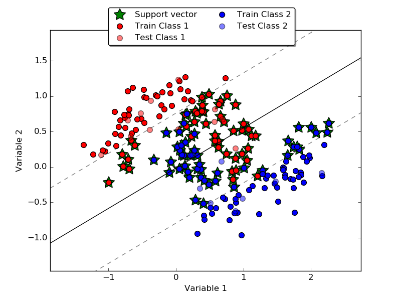

# A python implementation of SVM

## Code

A single class *SVM* in **svmtoy/SVM_toy.py**  
Implements 2 kernels : linear and gaussian  
Possibility to regularise the SVM with slack variables

## Theory

This approach lies heavily on notes by [Andrew Ng](https://www.google.fr/url?sa=t&rct=j&q=&esrc=s&source=web&cd=1&cad=rja&uact=8&ved=0CCEQFjAAahUKEwi2xojwnMnIAhUJ1BoKHaOYBaA&url=http%3A%2F%2Fcs229.stanford.edu%2Fnotes%2Fcs229-notes3.pdf&usg=AFQjCNFgwpyM6DhwER7grlPQYr1MBMzq7g&sig2=RzATdxTBlT8Fjk3OzJS64A) and  [C. Bishop chap 7](https://www.google.fr/url?sa=t&rct=j&q=&esrc=s&source=web&cd=1&cad=rja&uact=8&sqi=2&ved=0CCUQFjAAahUKEwjVw7_6nMnIAhWKbBoKHWI5DcY&url=http%3A%2F%2Fwww.rmki.kfki.hu%2F~banmi%2Felte%2FBishop%2520-%2520Pattern%2520Recognition%2520and%2520Machine%2520Learning.pdf&usg=AFQjCNGK0rl37Yr6R_X-9nxSeHZtM71xYA&sig2=pZNGRxEffej8pV10y_0rbQ&bvm=bv.105454873,d.d2s)

## Dependencies

- [cvxopt](http://cvxopt.org/) for convex optimisation
- [scikit-learn](http://scikit-learn.org/stable/) for datasets and cross_validation utilities
- [numpy](http://docs.scipy.org/doc/numpy/index.html) for scientific computations

## Example

	python svmtoy_examples.py

This gives the following figures :

**Using a linear kernel**

**Using a gaussian kernel**

